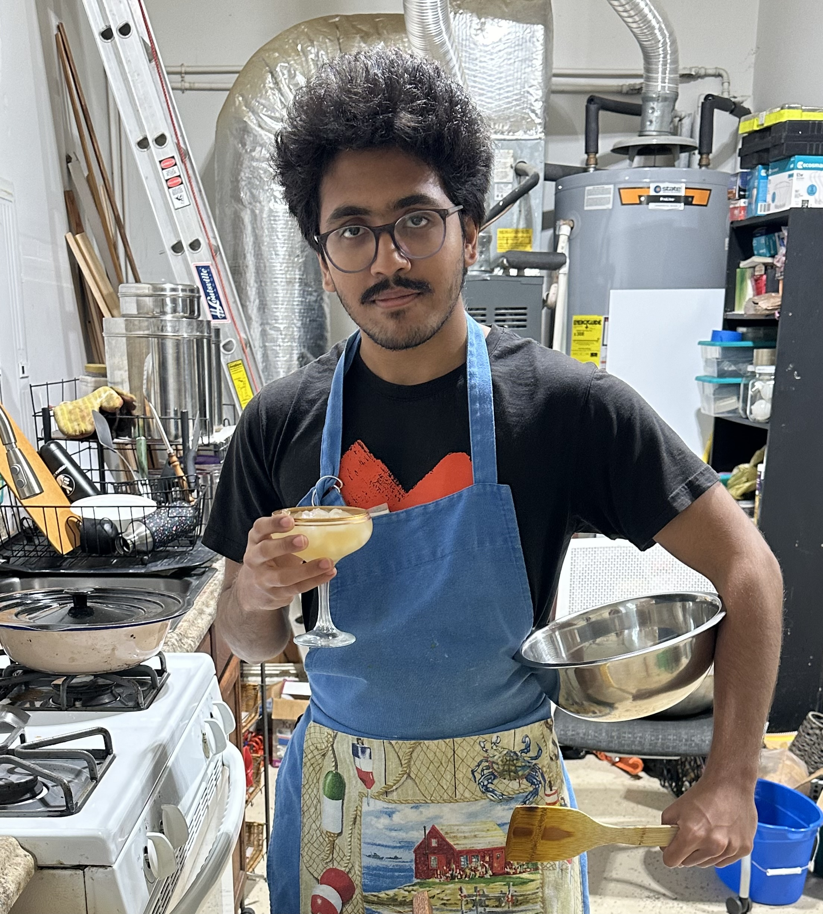

---
# Display name
title: Nirmal Patel

# Username (this should match the folder name)
authors:
  - nirmal

# Is this the primary user of the site?
superuser: false

# Role/position
role: PhD Student

# Organizations/Affiliations
organizations:
  - name: UT Austin
    url: ''

# Short bio (displayed in user profile at end of posts)
# bio: My research interests include 

interests:
  - Deep learning
  - Optimization
  - 3D Reconstruction

education:
  courses:
    - course: BS in Physics (Honors)
      institution: UT Austin
      year: 2024

# Social/Academic Networking
# For available icons, see: https://wowchemy.com/docs/getting-started/page-builder/#icons
#   For an email link, use "fas" icon pack, "envelope" icon, and a link in the
#   form "mailto:your-email@example.com" or "#contact" for contact widget.
social:
  - icon: envelope
    icon_pack: fas
    link: 'mailto:nirmpatel@utexas.edu'

# Link to a PDF of your resume/CV from the About widget.
# To enable, copy your resume/CV to `static/files/cv.pdf` and uncomment the lines below.
# - icon: cv
#   icon_pack: ai
#   link: files/cv.pdf

# Enter email to display Gravatar (if Gravatar enabled in Config)
email: ''

# Organizational groups that you belong to (for People widget)
#   Set this to `[]` or comment out if you are not using People widget.
user_groups:
  - Current Graduate Students
  #- Visitors
---

I graduated with my bachelors in physics from UT Austin in 2024. During my bachelor's degree, I worked on Physics Informed Neural Networks (PINNs) and its demonstration in black hole perturbation simulation. Currently, I am exploring different research topics in deep learning, optimization, and 3D reconstruction. In my free time, I lift weights and try out different board games and sports.

