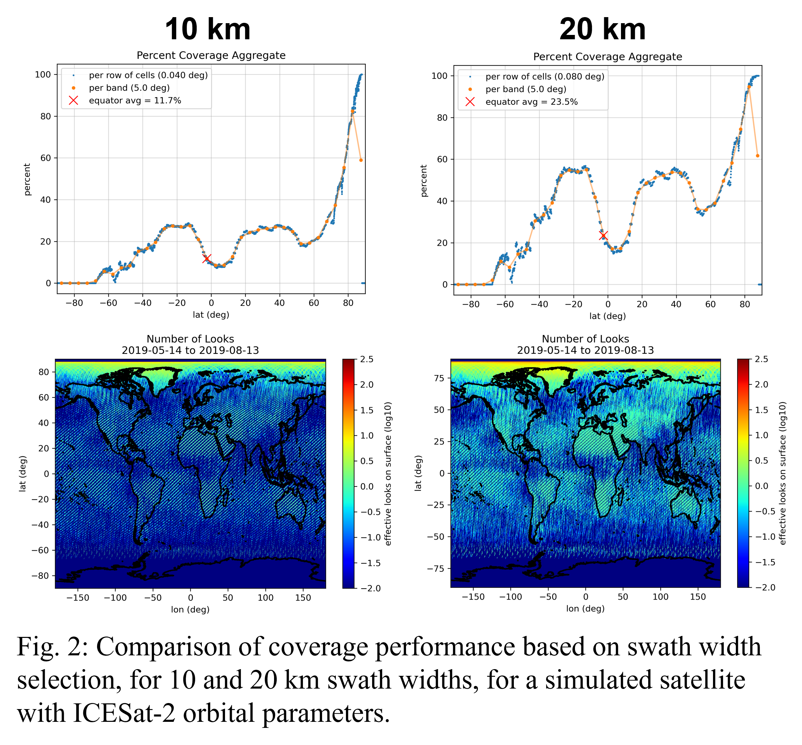
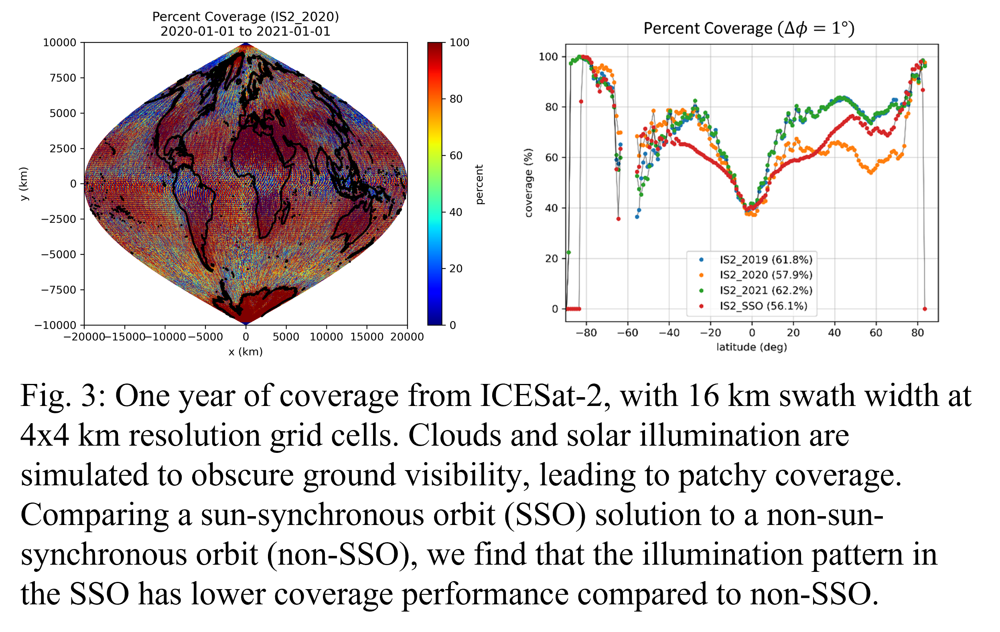

<!--more-->

## Major Activities

Modern remote sensing science objectives call for multi-instrument measurement collection under
ever-stringent mission requirements. Distributed spacecraft missions (DSMs) answer the demand, with
multi-satellite mission architectures, capable of fast revisit intervals and expansive coverage capacity.
Variations in instrument, orbit, and the number of satellites expand the trade space combinatorically,
leading to computationally demanding mission design. Evaluating trade space intelligently is prevalent in
literature, but the fundamental computational burden rests on figure of merit (FOM) calculation,
quantifying architecture performance. The Grid Point Approach (GPA) is a numerical method to develop
FOMs, but poor efficiency leads to slow evaluation of prospective DSM candidates. We introduce a
novel method, Iterative Swath Envelope Gridding (I-SEG), fulfilling the need for faster DSM FOM
calculation. I-SEG runtime is nearly invariant to temporal accuracy and varies by the inverse of grid cell
size (GCS) for constant swath to GCS ratio, thereby scaling to high temporal and spatial resolution.
Simple coverage metrics such as the number of observations, percent coverage, or revisit frequency are
prevalent in industry and literature. Beyond kinematic calculation, satellite data simulation (SDS) is a
process to simulate instrument measurements for mission software development (for Level-0, 1, and 2
products). We seek to bridge the gap between the simple coverage metric calculation and instrument
measurement performance from SDS, creating a framework for surrogate instrument model
development. In tandem with I-SEG, we overcome the computational burden inherent in DSM design,
while enhancing design with instrument-specific performance evaluation.

## Significant Results

Currently, only I-SEG has been published. In some cases, it is 1000x faster than methods currently
utilized in commercial applications, such as the Tradespace Analysis Tool for Constellations (TAT-C ML)
or Systems Tool Kit (STK). However, a single factor is naïve to represent the true utility of I-SEG. By
runtime complexity, I-SEG is numerical in space, roughly scaling by the root of the number of grid points,
and semi-analytical in time, weakly logarithmically dependent on time-step size. On the contrary,
methods in literature at least scale in runtime by the inverse of time-step size. At worst, methods
additionally scale by the square of the number of grid points, leading to long propagation runtime. I-SEG
effectively scales with swath size instead of by total area considered, enabling high spatial and temporal
resolution over wide regions, and over long simulation periods. With the fundamental speed increase,
we additionally impose instrument models within access calculation, which is the basis of current
research.

