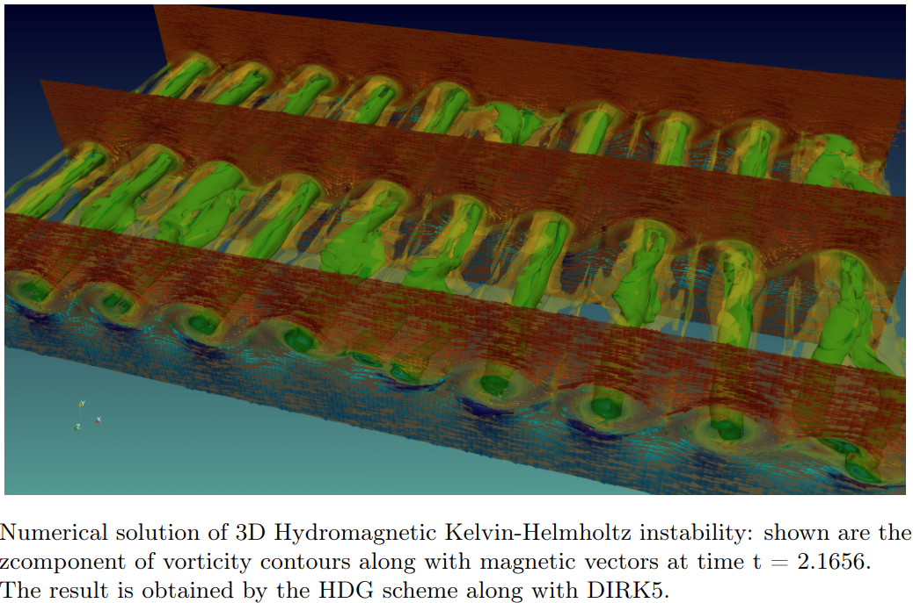

<!--more-->

## Major Activities
Advanced Tokamak simulations need rigorous high-order accuracy, efficient temporal simulations at desperately different scales.
> * We proposed and analyzed a high-order hybridized Discontinuous Galerkin (HDG) framework for MHD system to achieve stable and high-order accuracy in space
> * We proposed and analyzed multigrid, multilevel approaches for HDG
> * We proposed and analyzed high-order IMEX and exponential time integrators to over time-step limitation due to fast physics
> * We proposed and analyzed an hp-HDG for Friedrchs system

To checkout the latest news about our develpment on DG/HDG, please see [TDS website](https://tds-scidac.github.io/hdg/)
 
<!---
#### Ensemble Kalman Filter (EnKF) through the lens of duality
The EnKF for inverse problems can be viewed as a special case of the randomized right sketching algorithm. Due to the randomization of the covariance matrix (Regularization) involved, the right sketching algorithm often yields poor results as evident from the Figure below. Therefore, iterative versions of the EnKF is often employed for higher estimation accuracy. We take a new look at the Ensemble Kalman Filter through the lens
of duality. In particular, we show that by dealing with a randomized Lagrangian dual function, the estimation equations as well as asymptotic/non asymptotic convergence results can be derived for the EnKF.  Furthermore, we show that such an interpretation allows one to design improved EnKF algorithms for finding the inverse solution which converges faster.
--->

## Significant Results

 
<!-- Some beautiful pictures or videos could go here -->
<!--  -->

